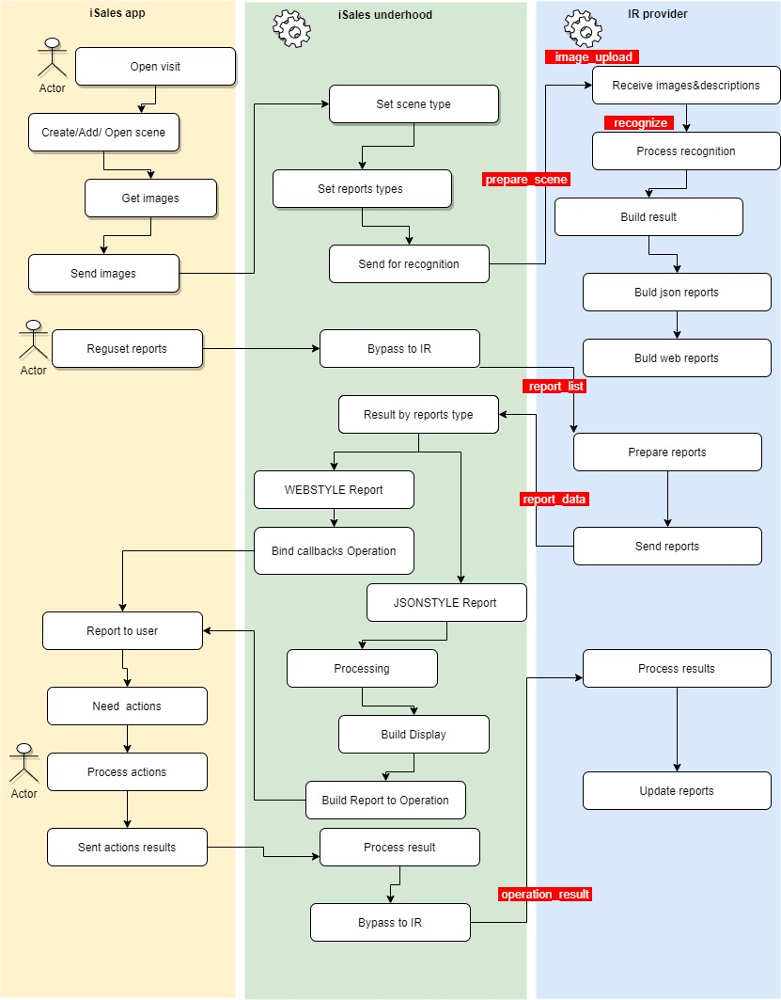
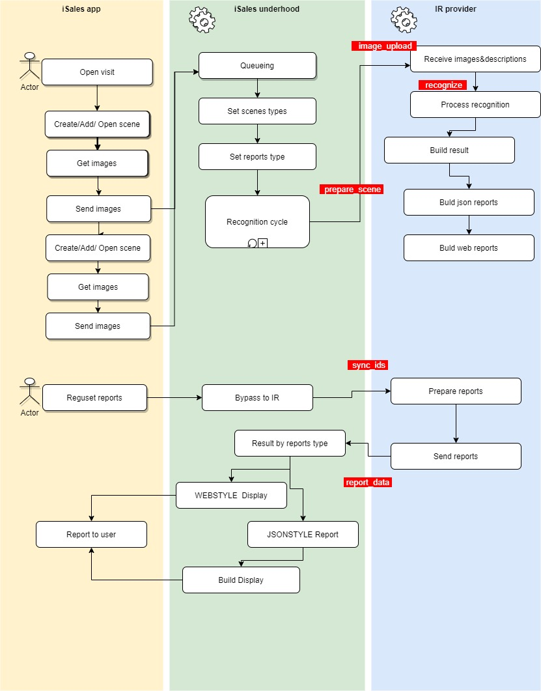
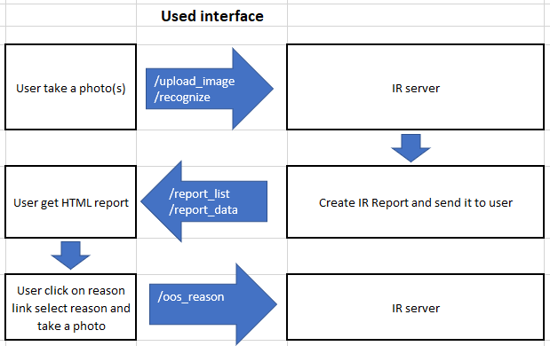

# PepsiCo iSales Frontend API Documentation (Version 1.8)

This documentation describes the PepsiCo iSales Frontend API, designed for integration with the Image Recognition (IR) system. The API enables management of visits to points of sale, scenes, images, and reports related to product recognition on shelves.

## Table of Contents

1. [Introduction](#introduction)  
   1.1 [Logical Objects](#logical-objects)  
   1.2 [Objects Relation](#objects-relation)  
   1.3 [Interaction Concept](#interaction-concept)  
       1.3.1 [Online Visit General Scheme](#online-visit-general-scheme)  
       1.3.2 [Offline Visit General Scheme](#offline-visit-general-scheme)  
       1.3.3 [General Actions](#general-actions)  

2. [Types Definition](#types-definition)  
   2.1 [ReportStatus Enumeration](#reportstatus-enumeration)  
   2.2 [SeriesType Enumeration](#seriestype-enumeration)  
   2.3 [SceneType Type](#scenetype-type)  
   2.4 [KeyValue Type](#keyvalue-type)  
   2.5 [Rectangle Type](#rectangle-type)  
   2.6 [Hint Type](#hint-type)  
   2.7 [SeriesDesc Type](#seriesdesc-type)  
   2.8 [ImageUnit Type](#imageunit-type)  
   2.9 [ReportType Type](#reporttype-type)  
   2.10 [SFA Metadata](#sfa-metadata)  
   2.11 [Image Metadata](#image-metadata)  

3. [Actions](#actions)  
   3.1 [Scene Preparation](#scene-preparation)  
   3.2 [Image Upload](#image-upload)  
   3.3 [Image Delete](#image-delete)  
   3.4 [Get Reports List](#get-reports-list)  
   3.5 [Get Report(s) Data](#get-reports-data)  
   3.6 [Get Last Consolidated Visits History](#get-last-consolidated-visits-history)  
   3.7 [Set Reason for Unrecognized Product](#set-reason-for-unrecognized-product)  

4. [Use Cases](#use-cases)  
   4.1 [Normal Online Visit](#normal-online-visit)  

---

## Introduction

The PepsiCo iSales Frontend API is designed to integrate with the Image Recognition (IR) system, providing point-of-sale visit management, image processing, and product recognition reports. The main goal is to automate the accounting of products on shelves and monitor the performance of tasks by agents in stores.

### Logical Objects

Logical objects represent the key entities used in the API:

- **Visit**: Represents all activities performed at a point of sale during a real visit to a customer.  
- **Scene Type (Task ID)**: Characterizes a specific location in the point of sale with a combination of reports, actions, and KPIs.  
- **Scene**: An entity of a particular scene type that defines the physical scene during a visit. Each scene is associated with one Scene Type, which defines the list of reports, actions, and KPIs. A visit can contain multiple scenes of the same or different Scene Types. Scenes include photos linked to the scene and reports based on recognition results.  
- **Photo**: A single image uploaded to the image recognition system. Each image has an internal and/or external ID used for recognition or other actions.  
- **Photos Series**: Represents the order of photos captured according to defined rules.  
- **Request**: An image recognition request for a set of images in one scene.  
- **Report Type**: Describes a set of characteristics obtained from recognition, including KPIs, service information, error details, or analytics.  
- **Report**: The result of a Report Type for scene recognition in a specific scene.

### Objects Relation


### Interaction Concept

The API supports two main interaction scenarios.

#### Online Visit General Scheme

  

#### Offline Visit General Scheme



#### General Actions

The API provides the following general actions for managing visits and recognition:

| Category                                    | Action                | Description                                              |
|---------------------------------------------|-----------------------|----------------------------------------------------------|
| **Recognition**                             | [prepare_scene](#scene-preparation)         | Early preparation scene and visit if it is applicable.   |
|                                             | [image_upload](#image-upload)               | Upload image to IR.                                      |
|                                             | [image_delete](#image-delete)               | Delete image from IR.                                    |
|                                             | [recognize](#recognize)                     | Request of recognition uploaded images.                  |
|                                             | [finalize_visit](#finalize-visit)           | Finalizing the visit in the shop.                        |
| **Status of Recognition**                   | [report_list](#get-reports-list)            | Get list of results of recognition with status.          |
| **Manipulation with Result of Recognition** | [report_data](#get-reports-data)            | Get result(report) of recognition.                       |
|                                             | [image_download](#image-download)           | Download images from IR backend.                         |
| **Interactive Operations with Results (Reports)** | [operation_result](#operation-result) | Back user interaction result to IR backend.              |
|                                             | [reference_description](#reference-description) | Get extra description of report element.                 |
|                                             | [oos_reason](#set-reason-for-unrecognized-product) | Set the reason for unrecognized product.                 |
| **Services**                                | [sync_ids](#sync-ids)                       | IDs synchronization between SFA and IR.                  |
|                                             | [api_version](#api-version)                 | Return supported version by IR provider, minimum version 1.5. |
| **History**                                 | [history_visitsids](#history-visits-by-ids) | Get last consolidated visits history by IDs.             |
|                                             | [history_visits](#get-last-consolidated-visits-history) | Get last consolidated visits history by parameters.      |



---

## Types Definition

### ReportStatus Enumeration

Defines the status of reports on the server side.

| Code      | Description                                                                 |
|-----------|-----------------------------------------------------------------------------|
| READY     | Report fully ready and can be downloaded.                                   |
| NOTREADY  | Report not yet ready, report data will be empty. To refresh report status needed to request server again. |
| ERROR     | Faced some error during recognize.                                          |

### SeriesType Enumeration

Represents the type of photo series, to be agreed with the IR provider.

| Code                      | Description                              |
|---------------------------|------------------------------------------|
| will be agreed with IR provider | Type of sequence (Down-Up-Left, Snaking and etc). |

**Note**: Specific values for `SeriesType` are to be defined in collaboration with the IR provider.

### SceneType Type

Represents the type of scene, agreed with the IR provider. Type is a string enumeration stored in the SFA database.

| Field | Type   | Required | Description                                              |
|-------|--------|----------|----------------------------------------------------------|
| type  | String | Yes      | Enumeration will be agreed with IR provider. Type of scene (Main shelf, Cold zone, Cooler and etc). |
| name  | String | No       | Name of scene.                                           |

### KeyValue Type

Represents a key-value pair in JSON format.

| Field | Type   | Required | Description                     | Example                     |
|-------|--------|----------|---------------------------------|-----------------------------|
| key   | String | Yes      | Key identifier.                 | "shopid"                    |
| value | String | Yes      | Value associated with the key.  | "i29"                       |

**Example**:
```json
{
  "key": "shopid",
  "value": "i29"
}
```

### Rectangle Type

Represents a rectangular area on an image.

| Field  | Type   | Required | Description                     |
|--------|--------|----------|---------------------------------|
| top    | String | Yes      | Offset relevant to topleft coner. |
| left   | String | Yes      | Offset relevant to topleft coner. |
| bottom | String | Yes      | Offset relevant to topleft coner. |
| right  | String | Yes      | Offset relevant to topleft coner. |

### Hint Type

Represents a notification or hint message.

| Field   | Type   | Required | Description                     |
|---------|--------|----------|---------------------------------|
| type    | String | Yes      | Notification type (ERR/WARNING/OK). |
| message | String | Yes      | Hint message.                   |

### SeriesDesc Type

Describes a series of photos for a particular image.

| Field  | Type        | Required | Description                                              |
|--------|-------------|----------|----------------------------------------------------------|
| key    | String      | Yes      | Series key (stitching image).                            |
| line   | String      | Yes      | Line number of photo relatively to the first photo.      |
| colmn  | String      | Yes      | Column number of photo relatively to the first photo.    |
| type   | SeriesType  | Yes      | Series type.                                             |

### ImageUnit Type

Represents an image captured in the user interface.

| Field        | Type   | Required | Description                                              |
|--------------|--------|----------|----------------------------------------------------------|
| ext_image_id | String | Yes      | External image ID.                                       |
| datafile     | String | Yes      | Jpeg image (format will be agreed with IR provider).     |

### ReportType Type

Represents the code of a recognition report, defining what must be recognized.

| Field | Type          | Required | Description                                              |
|-------|---------------|----------|----------------------------------------------------------|
| code  | String        | Yes      | Const value (values are agreed between SFA and IR provider). |
| flags | Array[String] | No       | Report flags (WEBSTYLE/JSONSTYLE/MIXSTYLE).              |

**Report Flags**:

| Flag      | Description                                              |
|-----------|----------------------------------------------------------|
| WEBSTYLE  | Report to be shown (in html format) and can be processed by end-user in SFA. |
| JSONSTYLE | Report should be processed by SFA.                       |
| MIXSTYLE  | Reserved.                                                |

### SFA Metadata

Metadata for a visit in the SFA system.

| Field                     | Type           | Required | Description                     | Example                                          |
|---------------------------|----------------|----------|---------------------------------|--------------------------------------------------|
| route                     | String         | Yes      | Route number.                   | "RUNOGD"                                         |
| shopid                    | String         | Yes      | Shop ID.                        | "0200231621"                                     |
| agentid                   | String         | Yes      | Agent ID.                       | "80322598"                                       |
| role                      | String         | Yes      | Agent role.                     | "Merch+"                                         |
| orgid                     | String         | Yes      | Organization ID.                | "1"                                              |
| scene_additional_attributes | Array[KeyValue] | No      | Additional scene attributes.    | [{"key": "0", "value": "test_l1_l1_l1"}, {"key": "1", "value": "test_l1_l1_id1"}, {"key": "2", "value": "test_l3_id1"}] |
| scene_attribute           | Array[String]  | No       | Scene attributes.               | ["AEP", "(1)", "Снеки", "Колонна", "Lays", "G-110"] |
| flag_after                | Integer (0-2)  | No       | Completion flag.                | "0"                                              |

**Example**:
```json
{
  "route": "RUNOGD",
  "shopid": "0200231621",
  "agentid": "80322598",
  "role": "Merch+",
  "orgid": "1",
  "scene_additional_attributes": [
    {"key": "0", "value": "test_l1_l1_l1"},
    {"key": "1", "value": "test_l1_l1_id1"},
    {"key": "2", "value": "test_l3_id1"}
  ],
  "scene_attribute": ["AEP", "(1)", "Снеки", "Колонна", "Lays", "G-110"],
  "flag_after": "0"
}
```

**Note**: In some examples (e.g., `prepare_scene`), `scene_attribute` is a string (e.g., "[AEP;(1);Снеки;Колонна;Lays;G-110]"). This may indicate a need for clarification with the IR provider.

### Image Metadata

Metadata describing the shooting conditions of an image.

| Field      | Type   | Required | Description                     | Example                     |
|------------|--------|----------|---------------------------------|-----------------------------|
| longitude  | String | Yes      | Longitude of capture location.  | "82,9467941"                |
| latitude   | String | Yes      | Latitude of capture location.   | "54,9603282"                |
| brightness | String | Yes      | Image brightness.               | "87"                        |
| contrast   | String | Yes      | Image contrast.                 | "241,527628537085"          |
| sword      | String | Yes      | (Possibly gyro roll angle).     | "-0,9965955"                |
| gyropitch  | String | Yes      | Gyro pitch angle.               | "5,985871"                  |

**Example**:
```json
{
  "longitude": "82,9467941",
  "latitude": "54,9603282",
  "brightness": "87",
  "contrast": "241,527628537085",
  "sword": "-0,9965955",
  "gyropitch": "5,985871"
}
```

---

## Actions

Actions are the main endpoints used for all types of operations. Each action has its own ID and parameter list. The response data and structure depend on the action.

**Endpoint**: `URL/action`

**Request Data**:

| Field       | Type          | Description                              |
|-------------|---------------|------------------------------------------|
| action_id   | String        | Action ID.                               |
| parameters  | JSON Object   | List of parameters for the action ID.    |

**Response Data**:

| Field | Type        | Description                              |
|-------|-------------|------------------------------------------|
| Data  | JSON Object | Dictionary of response data for action.  |

### Scene Preparation

**Action ID**: `prepare_scene`

Used for early preparation (create/open) of scene and visit objects. If a visit does not exist, it should be created. Each report is compiled for all images in the scene, suitable for combining photos of different parts of one shelf or multiple shelves of one product category. The action always returns response fields, even if the visit/scene already exists, without error messages for existing records.

**Request Parameters**:

| Field                     | Type           | Required | Description                     | Example                                          |
|---------------------------|----------------|----------|---------------------------------|--------------------------------------------------|
| ext_visit_id              | String         | Yes      | External Visit ID.              | "9bf27010-393c-4a00-8b7e-05277469a334"          |
| ext_scene_id              | String         | Yes      | External Scene ID.              | "4b4e8b09-cf1e-48c8-a8bc-c8f20e9c9348"          |
| visit_started             | String         | Yes      | Timestamp in ISO 8601 format.   | "2023-10-02T16:47:41+04:00"                      |
| scene_type                | SceneType      | Yes      | Scene type.                     | {"type": "WBD_COLD_SHELF", "name": "имя 1"}      |
| report_types              | Array[ReportType] | Yes   | List of reports to generate.    | [{"code": "FACING_COUNT", "flags": "WEBSTYLE"}]  |
| metadata                  | Array[KeyValue] | Yes     | SFA metadata.                   | {"route": "RUMGEE", "shopid": "0200231621", ...} |
| optional                  | Array[KeyValue] | Yes     | Additional parameters (TBD).    | {}                                               |

**Example Request**:
```json
{
  "action_id": "prepare_scene",
  "parameters": {
    "ext_visit_id": "9bf27010-393c-4a00-8b7e-05277469a334",
    "ext_scene_id": "4b4e8b09-cf1e-48c8-a8bc-c8f20e9c9348",
    "visit_started": "2023-10-02T16:47:41+04:00",
    "scene_type": {
      "type": "WBD_COLD_SHELF",
      "name": "имя 1"
    },
    "report_types": [
      {
        "code": "FACING_COUNT",
        "flags": "WEBSTYLE"
      }
    ],
    "metadata": {
      "route": "RUMGEE",
      "shopid": "0200231621",
      "agentid": "69657",
      "role": "CR 3PD",
      "orgid": "1",
      "scene_attribute": "[имя 1]",
      "flag_after": "0"
    },
    "optional": {}
  }
}
```

**Response Fields**:

| Field          | Type   | Required | Description                     | Example                     |
|----------------|--------|----------|---------------------------------|-----------------------------|
| prepare        | String | Yes      | Y/N prepared or action skipped. | "Y"                         |
| int_visit_id   | String | No       | Internal visit ID.              | "10487751"                  |
| int_scene_id   | String | No       | Internal scene ID.              | "58343096"                  |

**Example Response**:
```json
{
  "Data": {
    "prepare": "Y",
    "int_visit_id": "10487751",
    "int_scene_id": "58343096"
  }
}
```

### Image Upload

**Action ID**: `image_upload`

Uploads images to the service. Only JPEG images are supported.

**Request Parameters**:

| Field        | Type        | Required | Description                     | Example                                          |
|--------------|-------------|----------|---------------------------------|--------------------------------------------------|
| ext_image_id | String      | Yes      | External image ID.              | "fcd4bdae-1c76-4175-a3be-20ca70c7c188"          |
| datafile     | String      | Yes      | JPEG image (Base64 encoded).    | "base64(image)"                                  |
| Series       | SeriesDesc  | No       | Series if applicable.           | {"key": "0", "line": "0", "colmn": "0", "type": "LEFT"} |
| Crop         | Rectangle   | No       | Crop zone.                      | {"top": "0", "left": "0", "bottom": "0", "right": "0"} |
| ext_visit_id | String      | Yes      | External Visit ID.              | "b8a88a19-dd1b-428e-a539-d4ea6457ec4b"          |
| ext_scene_id | String      | Yes      | External Scene ID.              | "6de70bf1-e0b2-4a8b-a30d-2a1691051ede"          |
| int_visit_id | String      | Yes      | Internal Visit ID.              | "10487751"                                       |
| int_scene_id | String      | Yes      | Internal Scene ID.              | "58342889"                                       |
| metadata     | Array[KeyValue] | No   | Image metadata.                 | {"longitude": "82,9467941", "latitude": "54,9603282", ...} |

**Example Request**:
```json
{
  "action_id": "image_upload",
  "parameters": {
    "ext_image_id": "fcd4bdae-1c76-4175-a3be-20ca70c7c188",
    "datafile": "base64(image)",
    "Series": {
      "key": "0",
      "line": "0",
      "colmn": "0",
      "type": "LEFT"
    },
    "Crop": {
      "top": "0",
      "left": "0",
      "bottom": "0",
      "right": "0"
    },
    "ext_visit_id": "b8a88a19-dd1b-428e-a539-d4ea6457ec4b",
    "ext_scene_id": "6de70bf1-e0b2-4a8b-a30d-2a1691051ede",
    "int_visit_id": "10487751",
    "int_scene_id": "58342889",
    "metadata": {
      "longitude": "82,9467941",
      "latitude": "54,9603282",
      "brightness": "87",
      "contrast": "241,527628537085",
      "gyroroll": "-0,9965955",
      "gyropitch": "5,985871"
    }
  }
}
```

**Response Fields**:

| Field       | Type     | Required | Description                     | Example                                          |
|-------------|----------|----------|---------------------------------|--------------------------------------------------|
| int_image_id | String  | Yes      | Internal image ID.              | "308791294"                                      |
| width       | String   | Yes      | Image width.                    | "1548"                                           |
| Height      | String   | Yes      | Image height.                   | "2064"                                           |
| url         | String   | Yes      | URL of uploaded image.          | "https://site.com/images/77c6cad6-e421-4475-a449-daf6b8a20655.jpg" |
| Created     | Datetime | Yes      | Date and time of image sent.    | "2023-09-18T05:19:52.306941+03:00"               |

**Example Response**:
```json
{
  "Data": {
    "int_image_id": "308791294",
    "width": "1548",
    "Height": "2064",
    "url": "https://site.com/images/77c6cad6-e421-4475-a449-daf6b8a20655.jpg",
    "Created": "2023-09-18T05:19:52.306941+03:00"
  }
}
```

### Image Delete

**Action ID**: `image_delete`

Deletes images from the service.

**Request Parameters**:

| Field        | Type   | Required | Description                     | Example                                          |
|--------------|--------|----------|---------------------------------|--------------------------------------------------|
| int_image_id | String | No       | Internal image ID.              | "195202009"                                      |
| ext_image_id | String | No       | External image ID.              | "49ae850f-a38b-444d-882d-992b23eac7f1"          |

**Note**: At least one of `int_image_id` or `ext_image_id` must be provided.

**Example Request**:
```json
{
  "action_id": "image_delete",
  "parameters": {
    "int_image_id": "195202009",
    "ext_image_id": "49ae850f-a38b-444d-882d-992b23eac7f1"
  }
}
```

**Response Fields**:
No required fields.

### Get Reports List

**Action ID**: `report_list`

Returns a list of reports linked to the target visit ID and scene ID.

**Request Parameters**:

| Field        | Type   | Required | Description                     |
|--------------|--------|----------|---------------------------------|
| int_visit_id | String | Yes      | Internal visit ID (filter).     |
| int_scene_id | String | No       | Internal scene ID (filter).     |
| ext_visit_id | String | Yes      | External Visit ID.              |
| ext_scene_id | String | Yes      | External Scene ID.              |
| route        | String | Yes      | Route ID (SFA Metadata).        |
| date_report  | String | Yes      | Date for report creation.       |

**Response Fields** (Array of):

| Field        | Type         | Required | Description                              |
|--------------|--------------|----------|------------------------------------------|
| request_id   | String       | Yes      | Request ID for results/status.           |
| datetime     | Datetime     | Yes      | Date and time of request sent.           |
| status       | ReportStatus | Yes      | Status of all reports in the request.    |
| message      | String       | Yes      | Message corresponding to status.         |
| int_scene_id | String       | Yes      | Internal scene ID of the request.        |

### Get Report(s) Data

**Action ID**: `report_data`

Returns status and results of reports. Supports filtering by request IDs, scene IDs, or visit ID.

**Request Parameters**:

| Field        | Type            | Required | Description                              |
|--------------|-----------------|----------|------------------------------------------|
| requests     | Array[String]   | No       | List of request IDs.                     |
| scenes       | Array[String]   | No       | List of internal scene IDs.              |
| int_visit_id | String          | No       | Internal visit ID.                       |
| ext_scenes   | Array[String]   | No       | List of external scene IDs.              |
| ext_visit_id | String          | No       | External Visit ID.                       |
| reports      | Array[ReportType] | No     | Specific report types to retrieve.       |
| ext_images   | Array[String]   | No       | External image IDs associated with request/scene. |

**Note**: At least one of `requests`, `scenes`, `int_visit_id`, `ext_scenes`, or `ext_visit_id` must be provided.

**Example Request**:
```json
{
  "action_id": "report_data",
  "parameters": {
    "requests": [],
    "int_visit_id": "10487751",
    "ext_visit_id": "b8a88a19-dd1b-428e-a539-d4ea6457ec4b",
    "scenes": ["58342889"],
    "ext_scenes": ["6de70bf1-e0b2-4a8b-a30d-2a1691051ede"],
    "ext_images": [],
    "reports": []
  }
}
```

**Response Fields** (Array of):

| Field        | Type            | Required | Description                              |
|--------------|-----------------|----------|------------------------------------------|
| request_id   | String          | No       | Current request ID.                      |
| int_visit_id | String          | Yes      | Internal visit ID.                       |
| int_scene_id | String          | Yes      | Internal scene ID.                       |
| int_images   | Array[String]   | No       | Internal image IDs associated with request/scene. |
| ext_images   | Array[String]   | No       | External image IDs associated with request/scene. |
| status       | ReportStatus    | Yes      | Status of current recognition.           |
| report_type  | ReportType      | Yes      | Type of report.                          |
| report_data  | JSON/Base64/HTML | Yes      | Report data (format depends on type).    |

**Example Response**:
```json
{
  "Data": [
    {
      "int_visit_id": "10487751",
      "int_scene_id": "58342889",
      "int_images": ["308791289", "308791294", "308791292", "308791295"],
      "ext_images": [
        "971c1264-0983-4881-ad00-c11962783192",
        "fcd4bdae-1c76-4175-a3be-20ca70c7c188",
        "c62601ed-8e75-43b9-8c73-3304c7784c5a",
        "4f78cc7c-c73f-4e9b-ab48-832c386be4a9"
      ],
      "status": "READY",
      "report_type": {"code": "SCENE_RENDER", "flags": "WEBSTYLE"},
      "report_data": "<button class='collapsible'><b>Бренд Блок_Lays <span style=\"color: #ff0000\">НЕТ</span></b></button><div class='content' style=\"display: none;\"><div style='margin-top:15px;'><table border=0><thead></thead><tbody><tr><td style=\"text-align: left;\">• Выровненные Бренд Блоки</td><td style=\"background-color: #ff0000;\">НЕТ</td></tr><tr><td style=\"text-align: left;\">…</td></tr></tbody></table></div></div>"
    }
  ]
}
```

### Get Last Consolidated Visits History

**Action ID**: `history_visits`

Retrieves a defined number of recent consolidated visits history, filtered by SFA metadata parameters.

**Request Parameters**:

| Field   | Type   | Required | Description                     |
|---------|--------|----------|---------------------------------|
| shopid  | String | Yes      | Shop ID (SFA Metadata).         |
| route   | String | Yes      | Route ID (SFA Metadata).        |
| orgid   | String | Yes      | Organization ID (SFA Metadata). |
| offset  | Number | Yes      | Number of past visits to retrieve. |
| agentid | String | No       | Agent ID (SFA Metadata, null = any agent). |
| role    | String | No       | Role (SFA Metadata, null = any agent). |

**Response Fields** (Array of):

| Field             | Type          | Required | Description                              |
|-------------------|---------------|----------|------------------------------------------|
| int_visit_id      | String        | Yes      | Internal visit ID.                       |
| agentid           | String        | Yes      | Agent ID (SFA Metadata).                 |
| Date_Time_of_visit | String       | Yes      | Date and time of visit.                  |
| history_data      | Base64 (HTML) | Yes      | Data of WEBSTYLE report (agreed with provider). |

### Set Reason for Unrecognized Product

**Action ID**: `oos_reason`

Allows users to specify the reason for an unrecognized product during recognition.

**Request Parameters**:

| Field        | Type   | Required | Description                     | Example                                          |
|--------------|--------|----------|---------------------------------|--------------------------------------------------|
| ext_scene_id | String | Yes      | External Scene ID.              | "b8a88a19-dd1b-428e-a539-d4ea6457ec4b"          |
| ext_visit_id | String | Yes      | External Visit ID.              | "dff35115-376c-44b9-b4fa-49ef3cece475"          |
| sku_cid      | String | Yes      | Product ID.                     | "4600494663550"                                  |
| component    | String | Yes      | Component ID (can be empty).    | "Напитки"                                        |
| reason       | String | Yes      | Reason for non-recognition.     | "Ошибка распознавания"                           |
| datafile     | String | No       | Image data (Base64 format).     | "base64(image)"                                  |

**Example Request**:
```json
{
  "action_id": "oos_reason",
  "parameters": {
    "ext_visit_id": "b8a88a19-dd1b-428e-a539-d4ea6457ec4b",
    "ext_scene_id": "dff35115-376c-44b9-b4fa-49ef3cece475",
    "sku_cid": "4600494663550",
    "component": "Напитки",
    "reason": "Ошибка распознавания",
    "datafile": "base64(image)"
  }
}
```

**Response Fields**:

| Field  | Type   | Required | Description                     |
|--------|--------|----------|---------------------------------|
| result | String | Yes      | Result of the operation.        |

**Process**:
1. iSales application sends images to the IR provider for recognition.
2. IR provider returns an HTML report with JavaScript scripts.
3. User clicks a link in the HTML report, triggering a dialog box to select a reason and optionally take a photo.
4. iSales sends the `oos_reason` action to the IR provider with the reason and photo (if applicable).

**HTML Report Requirements**:
IR reports must include links for unrecognized products:
```html
<a onclick="sp1(this, sku_cid, Image_photo_link)">Product name</a>
<a onclick="r3(this, 'sku_cid', 'component');">Причина</a>
```

**JavaScript Requirements**:
The following must be defined in the report's JavaScript:
```javascript
var reasonList = "Ошибка распознавания;Нет в AEP;Нет на складе;Виртуальный сток;ПДЗ;Запрет выкладки";

function sp1(self, sku_cid, Image_photo_link) {
  Android.showProduct(self.innerHTML, sku_cid, Image_photo_link);
}

function r3(e, component_name, isales_sku_code) {
  Android.showOosReasonDialog(component_name, isales_sku_code, reasonList);
}
```

- `Image_photo_link`: Link to the standard photo of the product.
- `sku_cid`: Product ID.

---

## Use Cases

### Normal Online Visit

**Plot**:  
Agent comes to a big store. In the store, there are one main shelf, two branded coolers with different configurations, and an additional branded rack. The agent should capture the state of the main shelf before and after working with the shelf, capture the states of the coolers and rack. The agent can interrupt their work, can decide to recapture wrong photos, and the order of the scenes is arbitrary.

**Workflow**:

| Agent                          | Action API             | SFA mobile                          | IR backend                       | Parameters stored in SFA          |
|--------------------------------|-----------------------|-------------------------------------|-----------------------------------|-----------------------------------|
| Start IR visit inside SFA visit | -                     | - Check visit conditions<br>- Create new visit ID `ext_visit_id` | -                                 | `ext_visit_id`                    |
| Open new main shelf            | [prepare_scene](#scene-preparation) | - Create new scene ID `ext_scene_id` with scene type<br>- Fill out paraments<br>- Request IR backend | - Process `prepare_scene` request<br>- Return `int_visit_id` and `int_scene_id` | `ext_visit_id`, `ext_scene_id`, `scene_type`, `report_types`, `metadata`, `optional` |
| Capture photos of main shelf   | [image_upload](#image-upload) | - Take photos<br>- Upload to IR backend | - Store images<br>- Assign `int_image_id` | `ext_image_id`, `datafile`, `ext_visit_id`, `ext_scene_id`, `int_visit_id`, `int_scene_id`, `metadata` |
| Request recognition            | [recognize](#recognize) | - Trigger recognition process | - Process images<br>- Generate recognition request | `ext_visit_id`, `ext_scene_id`, `int_visit_id`, `int_scene_id` |
| Get recognition report         | [report_list](#get-reports-list)<br>[report_data](#get-reports-data) | - Request report list<br>- Retrieve report data | - Return report list<br>- Provide report data | `int_visit_id`, `int_scene_id`, `status`, `report_data` |
| Work with coolers and rack     | [prepare_scene](#scene-preparation)<br>[image_upload](#image-upload) | - Create new scenes for coolers and rack<br>- Capture and upload photos | - Process requests<br>- Store images | `ext_scene_id`, `scene_type`, `ext_image_id`, `datafile`, etc. |
| Finalize visit                 | [finalize_visit](#finalize-visit) | - Complete visit process | - Update visit status | `ext_visit_id`, `int_visit_id` |

**Notes**:  
- The agent can interrupt work at any step and resume later.
- Wrong photos can be recaptured and re-uploaded using `[image_delete](#image-delete)` followed by `[image_upload](#image-upload)`.
- The order of scenes (main shelf, coolers, rack) is arbitrary and managed via multiple `prepare_scene` calls.
- Details for actions like `recognize` and `finalize_visit` require clarification with the IR provider.
