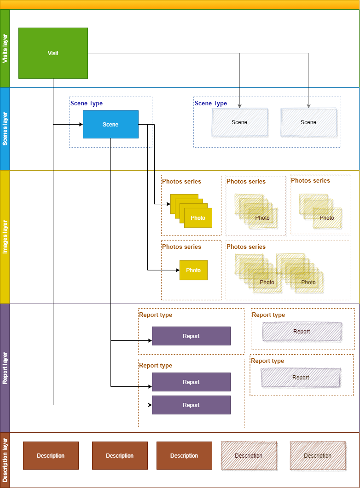

# PepsiCo iSales Frontend API Documentation (Version 1.8)

This documentation describes the PepsiCo iSales Frontend API, designed for integration with the Image Recognition (IR) system. The API enables management of visits to points of sale, scenes, images, and reports related to product recognition on shelves. All technical terms, fields, and examples are provided in English, as in the original document, to align with development standards.

## Table of Contents

1. [Introduction](#introduction)  
   1.1 [Logical Objects](#logical-objects)  
   1.2 [Objects Relation](#objects-relation)  
   1.3 [Interaction Concept](#interaction-concept)  
       1.3.1 [Online Visit General Scheme](#online-visit-general-scheme)  
       1.3.2 [Offline Visit General Scheme](#offline-visit-general-scheme)  
       1.3.3 [General Actions](#general-actions)  

2. [Types Definition](#types-definition)  
   2.1 [ReportStatus Enumeration](#reportstatus-enumeration)  
   2.2 [SeriesType Enumeration](#seriestype-enumeration)  
   2.3 [SceneType Type](#scenetype-type)  
   2.4 [KeyValue Type](#keyvalue-type)  
   2.5 [Rectangle Type](#rectangle-type)  
   2.6 [Hint Type](#hint-type)  
   2.7 [SeriesDesc Type](#seriesdesc-type)  
   2.8 [ImageUnit Type](#imageunit-type)  
   2.9 [ReportType Type](#reporttype-type)  
   2.10 [SFA Metadata](#sfa-metadata)  
   2.11 [Image Metadata](#image-metadata)  

---

## Introduction

The PepsiCo iSales Frontend API is designed to integrate with the Image Recognition (IR) system, providing point-of-sale visit management, image processing, and product recognition reports. The main goal is to automate the accounting of products on shelves and monitor the performance of tasks by agents in stores.

### Logical Objects

Logical objects represent the key entities used in the API:

- **Visit**: Represents all activities performed at a point of sale during a real visit to a customer.  
- **Scene Type (Task ID)**: Characterizes a specific location in the point of sale with a combination of reports, actions, and KPIs.  
- **Scene**: An entity of a particular scene type that defines the physical scene during a visit. Each scene is associated with one Scene Type, which defines the list of reports, actions, and KPIs. A visit can contain multiple scenes of the same or different Scene Types. Scenes include photos linked to the scene and reports based on recognition results.  
- **Photo**: A single image uploaded to the image recognition system. Each image has an internal and/or external ID used for recognition or other actions.  
- **Photos Series**: Represents the order of photos captured according to defined rules.  
- **Request**: An image recognition request for a set of images in one scene.  
- **Report Type**: Describes a set of characteristics obtained from recognition, including KPIs, service information, error details, or analytics.  
- **Report**: The result of a Report Type for scene recognition in a specific scene.

### Objects Relation



This structure allows for hierarchical management of data, where a visit encapsulates multiple scenes, each with its own set of images and recognition results.

### Interaction Concept

API поддерживает два основных сценария взаимодействия:

#### Online Visit General Scheme

In an online visit, the agent works in real-time, uploading images to the server for immediate recognition. The process involves:
- Preparing the visit and scene.  
- Uploading images.  
- Requesting recognition.  
- Retrieving and analyzing reports.  

#### Offline Visit General Scheme

In an offline visit, images are stored locally on the device and uploaded later when an internet connection is available. The workflow is similar to the online visit but includes local storage and deferred upload steps.

#### General Actions

The API provides the following general actions for managing visits and recognition:

| Category                     | Action            | Description                                      |
|------------------------------|-------------------|--------------------------------------------------|
| **Recognition**              | prepare_scene     | Early preparation of scene and visit, if applicable. |
|                              | image_upload      | Upload images to the IR system.                  |
|                              | image_delete      | Delete an image from the IR system.              |
|                              | recognize         | Request recognition of uploaded images.          |
|                              | finalize_visit    | Finalize the visit in the shop.                  |
| **Status of Recognition**    | report_list       | Get a list of recognition results with status.   |
| **Manipulation with Results**| report_data       | Get recognition results.                         |

---

## Types Definition

Ниже описаны типы данных, используемые в API. Все поля и описания приведены на английском, как в оригинальном документе, для соответствия стандартам разработки.

### ReportStatus Enumeration

Defines the status of a report.

| Value       | Description                     |
|-------------|---------------------------------|
| READY       | Report is fully processed.      |
| NOT_READY   | Report is still processing.     |

### SeriesType Enumeration

Defines the type of photo series.

| Value       | Description                     |
|-------------|---------------------------------|
| LEFT        | Left part of a panorama.        |
| RIGHT       | Right part of a panorama.       |
| CENTER      | Center part of a panorama.      |

### SceneType Type

Represents the type of scene, agreed with the IR provider.

| Field | Type   | Required | Description                     |
|-------|--------|----------|---------------------------------|
| type  | String | Yes      | Scene type (e.g., "SHELF").     |
| name  | String | No       | Optional scene name.            |

### KeyValue Type

Represents a key-value pair in JSON format.

| Field | Type   | Description                     |
|-------|--------|---------------------------------|
| key   | String | Key (e.g., "shopId").           |
| value | String | Value (e.g., "128").            |

**Example**: 
```json
{"key": "shopId", "value": "128"}
```

### Rectangle Type

Represents a rectangular area on an image.

| Field  | Type   | Description                     |
|--------|--------|---------------------------------|
| top    | String | Offset from top-left corner.    |
| left   | String | Offset from top-left corner.    |
| bottom | String | Offset from top-left corner.    |
| right  | String | Offset from top-left corner.    |

### Hint Type

Represents a hint or notification.

| Field   | Type   | Description                     |
|---------|--------|---------------------------------|
| type    | String | Notification type (ERR/WARNING/OK). |
| message | String | Hint message.                   |

### SeriesDesc Type

Description of a photo series for a particular image.

| Field  | Type        | Description                     |
|--------|-------------|---------------------------------|
| key    | String      | Series key (for stitching images). |
| line   | String      | Line number relative to the first photo. |
| column | String      | Column number relative to the first photo. |
| type   | SeriesType  | Series type (e.g., LEFT, RIGHT, CENTER). |

### ImageUnit Type

Represents an image captured in the user interface.

| Field        | Type   | Required | Description                     |
|--------------|--------|----------|---------------------------------|
| ext_image_id | String | Yes      | External image ID.              |
| datafile     | String | Yes      | JPEG image data (Base64).       |

### ReportType Type

Represents the code of a recognition report.

| Field | Type          | Required | Description                     |
|-------|---------------|----------|---------------------------------|
| code  | String        | Yes      | Constant value agreed between SFA and IR provider. |
| flags | Array[String] | No       | Report flags (WEBSTYLE, JSONSTYLE, MIXSTYLE). |

**Report Flags**:

| Flag       | Description                     |
|------------|---------------------------------|
| WEBSTYLE   | Report in HTML format, can be processed by end-user in SFA. |
| JSONSTYLE  | Report to be processed by SFA programmatically. |
| MIXSTYLE   | Reserved for future use.        |

### SFA Metadata

Metadata for a visit in the SFA system.

| Field                     | Type           | Required | Description                     | Example                     |
|---------------------------|----------------|----------|---------------------------------|-----------------------------|
| route                     | String         | Yes      | Route number.                   | "RUN060"                    |
| shopId                    | String         | Yes      | Shop ID.                        | "0200231621"                |
| agentId                   | String         | Yes      | Agent ID.                       | "80322598"                  |
| role                      | String         | Yes      | Agent role.                     | "Merch+"                    |
| orgId                     | String         | Yes      | Organization ID.                | "1"                         |
| scene_additional_attribute | Array[KeyValue] | No      | Additional scene attributes.    | []                          |
| scene_attribute           | Array[String]  | No       | Scene attributes.               | ["shelf1"]                  |
| flag_after                | Integer (0-2)  | No       | Completion flag.                | "0"                         |

**Example**:
```json
{
  "route": "RUN060",
  "shopId": "0200231621",
  "agentId": "80322598",
  "role": "Merch+",
  "orgId": "1",
  "scene_additional_attribute": [],
  "scene_attribute": ["shelf1"],
  "flag_after": "0"
}
```

### Image Metadata

Metadata describing the shooting conditions of an image.

| Field      | Type   | Required | Description                     | Example                     |
|------------|--------|----------|---------------------------------|-----------------------------|
| longitude  | String | Yes      | Longitude of capture location.  | "82.9467941"                |
| latitude   | String | Yes      | Latitude of capture location.   | "54.9603282"                |
| brightness | String | Yes      | Image brightness.               | "87"                        |
| contrast   | String | Yes      | Image contrast.                 | "241.527628537085"          |
| gyroroll   | String | Yes      | Gyro roll angle.                | "-0.9965955"                |
| gyropitch  | String | Yes      | Gyro pitch angle.               | "5.985871"                  |

**Example**:
```json
{
  "longitude": "82.9467941",
  "latitude": "54.9603282",
  "brightness": "87",
  "contrast": "241.527628537085",
  "gyroroll": "-0.9965955",
  "gyropitch": "5.985871"
}
```
